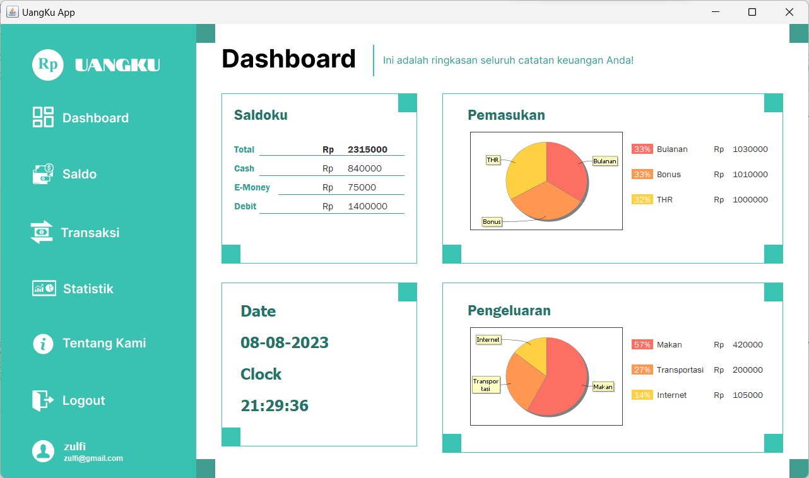
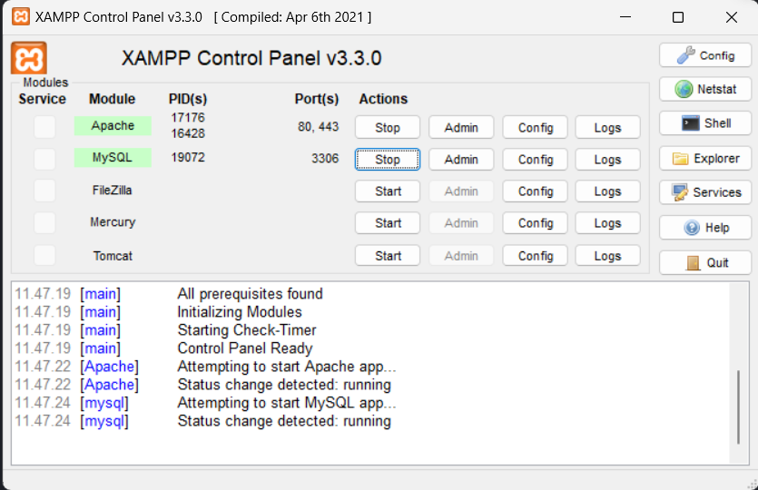
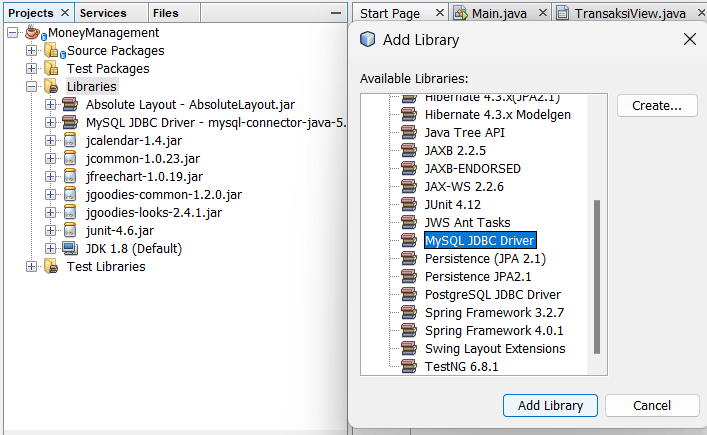
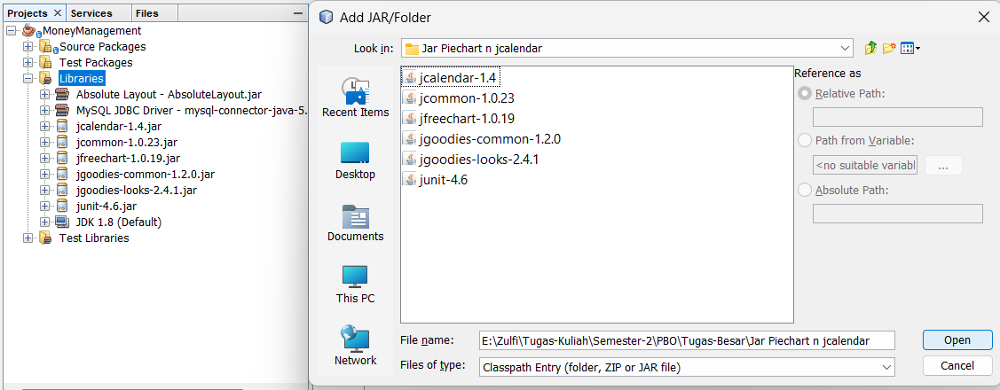
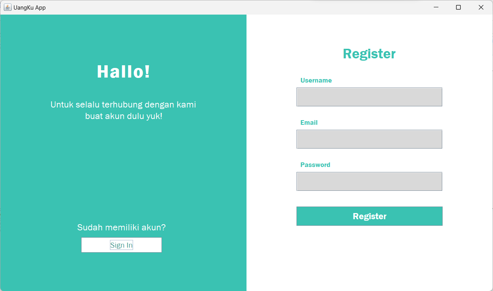
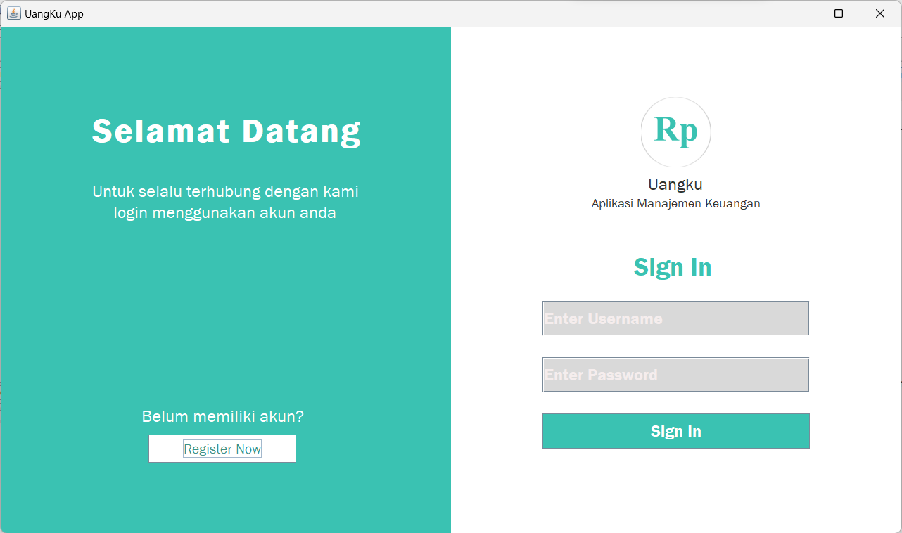
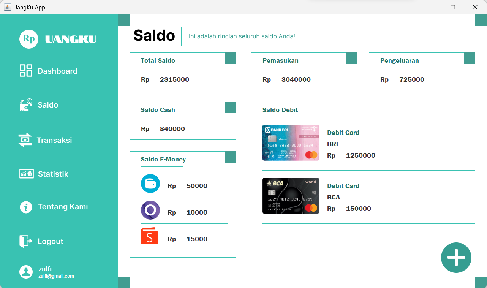
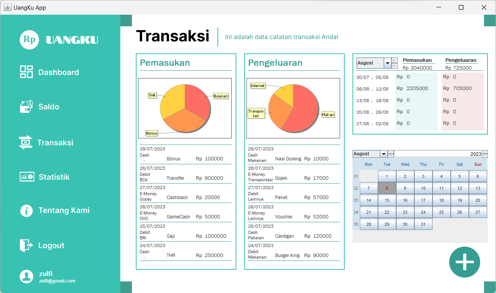
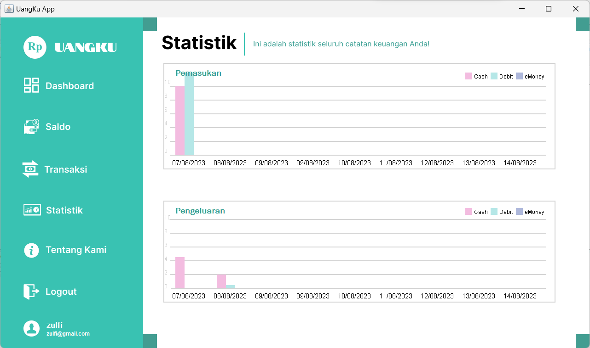

# UANGKU (Money Management App)


## Deskripsi
UANGKU merupakan sebuah aplikasi desktop yang digunakan untuk mengelola keuangan mahasiswa. App ini dikembangkan menggunakan bahasa pemrograman Java dan NetBeans IDE 8.2.


## Mockup
https://www.figma.com/file/nqP6addlRJBlW64qtBXIGJ/MoneyManagement?type=design&node-id=0%3A1&mode=design&t=rdPlGyEqxTH6vsY6-1

created by @TanTanTanisa

## Tools Yang Digunakan
- XAMPP Control Panel : Untuk database MySQL
- NetBeans IDE : Text Editor untuk menjalankan file Java

## Cara Menjalankan App
1. Pastikan XAMPP sudah terinstall di device. Jika belum klik <a href="https://www.apachefriends.org/download.html">Link Ini.</a>
2. Clone repository dengan menggunakan Git Bash atau Download Zip.
    ```
    git clone https://github.com/ZulfiFazhar/Money-Management.git
    ```
3. Buka XAMPP Control Panel anda, lalu Start services MySQL dan Apache Server.
    
4. Klik "Admin" di bagian Action MySQL. Lalu, import file <strong>.sql</strong> dari folder <strong> Money-Management </strong> yang sudah di download.
5. Buka NetBeans IDE anda dan open project <strong>Money-Management.</strong> Lalu, add Libraries <strong>MySQL JDBC Driver</strong> dengan cara klik kanan di folder <strong>Libraries > Add Library..</strong>
    
6. Tambahkan Library berupa .jar file dengan cara klik kanan di folder <strong>Libraries > Add JAR/Folder..</strong> dan pilih folder <strong>Jar Piechart n jcalendar</strong> dan masukkan seluruh file tersebut.
    
7. Untuk menjalankan Main file, pergi ke <strong>Source Packages > moneymanagement > Main > Main.java</strong>

Setelah langkah-langkah diatas dilakukan, anda dapat menjalankan App tersebut. 😎👊

## Fitur Utama
- Register Akun Pengguna
    
- Login Akun Pengguna
    
- Dashboard
    
- Tampilan Saldo
    
- Tampilan Detail Transaksi
    
- Tampilan Detail Statistik
    

## Contributors
- @BambangFirman
- @DrippinDoctor
- @TanTanTanisa
- @tijartaufikrahman
- @ZulfiFazhar
    
